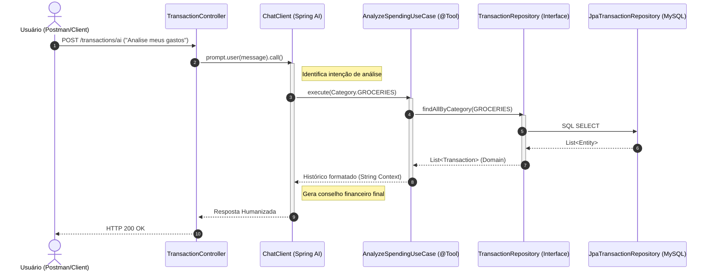

# IA Finance Manager - Clean Architecture API 🚀

Esta é uma API robusta de gestão financeira que utiliza inteligência artificial (**OpenAI via Spring AI**) para processar comandos em linguagem natural, categorizar transações automaticamente e fornecer análises preditivas de gastos. O projeto foi desenvolvido seguindo rigorosamente os princípios da **Arquitetura Limpa (Clean Architecture)** e **Arquitetura Hexagonal**.

## 🏗️ Arquitetura e Design

O projeto está dividido em camadas concêntricas, garantindo que o domínio seja independente de frameworks e ferramentas externas:

-   **Domain**: Contém as entidades de negócio (`Transaction`, `Category`) e as interfaces de contrato (`TransactionRepository`).
-   **Application**: Orquestra a lógica de negócio através de Casos de Uso (`PersistTransactionUseCase`, `AnalyzeSpendingUseCase`, etc.) e define as Ferramentas (Tools) que a IA pode consumir.
-   **Infrastructure**: Implementa os detalhes técnicos, como persistência (JPA/MySQL), segurança (JWT), e os adaptadores de entrada (REST Controllers).

## 🛠️ Tecnologias Utilizadas

-   **Java 21**
-   **Spring Boot 3.3+**
-   **Spring AI** (Integração com OpenAI)
-   **Spring Security & JWT** (Autenticação Stateless)
-   **Spring Data JPA**
-   **MySQL**
-   **Docker & Docker Compose**
-   **Lombok**
-   **Gradle** (Gerenciador de Dependências)

## 🔐 Segurança (JWT)

A API está protegida por **JSON Web Tokens**. Todas as rotas (exceto `/auth/login`) exigem o cabeçalho `Authorization: Bearer <token>`.

1.  **Login**: Envie um POST para `/auth/login` para obter o token.
2.  **Acesso**: Use o token gerado em todas as outras requisições.

## 🤖 Recursos de IA

O sistema utiliza **Function Calling** do Spring AI para permitir que o LLM interaja diretamente com o banco de dados de forma segura:
-   **Super Categorização**: Informe múltiplos gastos em um único texto e a IA os fatiará e persistirá individualmente.
-   **Oráculo Financeiro**: Peça análises como "Como estão meus gastos de mercado?" e receba um relatório inteligente.

---

## 📊 Fluxo de Execução (Diagrama de Sequência)

Abaixo, o fluxo detalhado de como a IA orquestra a chamada de ferramentas dentro da arquitetura limpa:



---

## 🚀 Como Executar

### Pré-requisitos
-   Docker e Docker Compose instalados.
-   Chave de API da OpenAI (`OPENAI_API_KEY`).

### Configuração
1. Clone o repositório.
2. Crie ou edite o arquivo `src/main/resources/application.properties` (ou use variáveis de ambiente):
   ```properties
   spring.ai.openai.api-key=${OPENAI_API_KEY}
   spring.datasource.url=jdbc:mysql://localhost:3306/finance_db
   api.security.token.secret=sua-chave-secreta-aqui
   ```

3. Suba o banco de dados via Docker:
   ```bash
   docker-compose up -d
   ```

4. Execute a aplicação:
   ```bash
   ./gradlew bootRun
   ```

## 🛣️ Endpoints Principais

| Método | Endpoint | Descrição |
| :--- | :--- | :--- |
| `POST` | `/auth/login` | Gera Token JWT de acesso. |
| `POST` | `/transactions` | Cria uma transação manualmente. |
| `GET` | `/transactions/{category}` | Lista transações por categoria. |
| `POST` | `/transactions/ai` | Processa comandos de texto via IA. |

---

Desenvolvido por **Leandro Meca** 👨‍💻